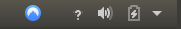
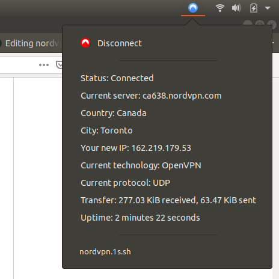
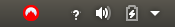
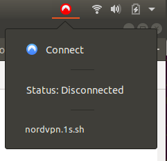

# nordvpn-gnome

Custom top-bar notification for nordvpn. Connection status to notify of sudden disconnection and easy access to connect/disconnect. First install [nordvpn](https://nordvpn.com/download/linux/) and then go through the following steps:

1. In firefox get "GNOME Shell integration" add-on.

2. Navigate to https://extensions.gnome.org/extension/1176/argos/ and press ON to download the extension. This should create the directory `~/.local/share/gnome-shell/extensions/argos@pew.worldwidemann.com` with files.

3. Copy `nordvpn.1s.sh` from this repository into `~/.config/argos` and within that directory in terminal run `chmod u+x nordvpn.sh`

4. Copy `nordvpn.svg` and `nordvpn_red.svg` into `/usr/share/icons/Adwaita/scalable/apps`. This will require sudo permissions so you must launch the file explorer in the terminal using `sudo nautilus &` where you will be able to copy the svg to this location.

5. Run `sudo gtk-update-icon-cache -f /usr/share/icons/Adwaita` to update your icon cache.

6. `Alt F2` and then 'r' + 'enter' to reset Gnome shell.

7. (Bonus) In `Ubuntu > Show applications > Startup Applications Preferences` then add `Command`: `nordvpn connect`. Now on every boot up, you will auto connect to nordvpn.

## Behaviour 

### nordvpn ON

When connected you will see blue nordvpn logo. 

If you press on the logo you will see

First button is to disconnect and the rest is the output of `nordvpn status`.

### nordvpn OFF

When disconnected you will see red nordvpn logo.

If you press on the logo you will see

First button is to connect and the rest is the output of `nordvpn status`.

